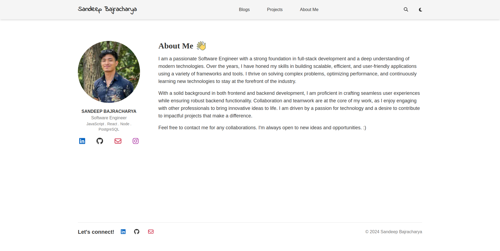

## Main stack
- Next.js (React framework)
- Node.js (Backend)
- PostgreSQL (Database)
- Prisma (ORM)
- Tailwind CSS (Styling)
- NextAuth (Authentication)

## Getting started
#### Flow the steps to run the project

```bash
1. pnpm install
2. copy .env.example to .env and add credentials
3. npx prisma migrate dev --name init
4. npx prisma db seed (seeds admin credentials to users table)
5. pnpm dev (run the server)
```

#### Uses Page based routing
Uses page based routing to create a dynamic routing system. This is simple and straing forward project and doesn't require any complex configurations and latest features like nested layouts.

## UI screenshots




